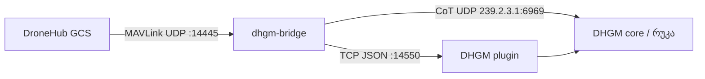

# ფაზა 2 — DHGM დრონის პანელი

> სტატუსი: **✅ ფაზა 2 + 3 დასრულებული** (v0.3.0) — plugin ცოცხლად მუშაობს; წყარო: GCS CotForwarder ან Python bridge.
> ეს დოკუმენტი UI/UX + პროტოკოლის სპეციფიკაციაა; კოდი `plugin/dhgm-drones/`-შია.

## რა მუშაობს (v0.2.0)
- ✅ plugin იტვირთება ATAK-ში (Compatible, plugin-api `com.atakmap.app@4.6.0.CIV`, ჩვენი key)
- ✅ პანელი: host:port input + „დაკავშირება" → bridge TCP (`0.0.0.0:14550`)
- ✅ თითო დრონზე ცოცხალი ბარათი: callsign, ფერადი ბატარეა/სტატუს-წერტილი, სიმაღლე/სიჩქარე/კურსი, რეჟიმი/GPS
- ✅ ბარათზე tap → რუკაზე ცენტრირება (`panTo`); მეორე tap → follow toggle (`▶`, teal); follow → რუკა ცოცხლად მიჰყვება
- ✅ stale ticker (2წმ) → სტატუს-წერტილი ნაცრისფრდება ტელემეტრიის შეწყვეტისას
- ✅ მრავალი დრონი: `dhgm_bridge.py --sim --sim-drones N`

**გაშვება:** `python3 bridge/dhgm_bridge.py --sim --sim-drones 3 --plugin-tcp 0.0.0.0:14550`
(⚠️ `0.0.0.0` — `127.0.0.1` ტელეფონიდან მიუწვდომელია.)

**შემდეგი (2c):** breadcrumb trail plugin-ში (კონტროლირებადი, ATAK-ის auto-trail-ის ლაგის მაგივრად),
RSSI/mode დამატებითი ველები, პანელი↔CoT მარკერის ორმხრივი highlight.

## მიზანი

DroneHub GCS-ის ტელემეტრია რუკაზე CoT-ით ჩანს, მაგრამ CoT შეზღუდულია (ბატარეა, სიმაღლე, კურსი).
**DHGM plugin** იძლევა:

- დრონების სიას ცოცხალი ტელემეტრიით (სიმაღლე, სიჩქარე, ბატარეა, რეჟიმი, GPS fix, RSSI)
- tap → follow + breadcrumb trail
- პირდაპირი კავშირი `dhgm-bridge`-თან (TCP JSON), CoT-ის გარდა

## არქიტექტურა



| არხი | პროტოკოლი | დანიშნულება |
|------|-----------|-------------|
| CoT multicast | UDP 239.2.3.1:6969 | რუკაზე ხატულა, გუნდური SA (არსებული) |
| Plugin stream | TCP localhost:14550 | მდიდარი ტელემეტრია, მრავალდრონიანი პანელი |

Bridge გაფართოება (ფაზა 2a): `--plugin-tcp 0.0.0.0:14550` — იგივე `DroneState`, JSON ხაზებად.

## UI მონახაზი — დრონის პანელი

### განლაგება (მარჯვენა drawer / ქვედა sheet)

```
┌─────────────────────────────────────┐
│  დრონები (2)              [↻] [⚙]  │  ← teal accent #17A79A
├─────────────────────────────────────┤
│ ● DH-1   120m AGL   15 m/s   87%   │  ← მწვანე = connected
│   რეჟიმი: AUTO   GPS: 3D Fix        │
│   [თვალყურის დევნება]  [დეტალები]  │
├─────────────────────────────────────┤
│ ○ DH-2   — stale 2m ago             │  ← ნაცარი = stale
│   ბოლო: 41.71°N 44.83°E            │
├─────────────────────────────────────┤
│  + bridge არ არის დაკავშირებული     │  ← ცარიელი მდგომარეობა
└─────────────────────────────────────┘
```

### ვიზუალური ტოკენები (DroneHub პალიტრა)

| ელემენტი | ფერი | გამოყენება |
|----------|------|------------|
| ფონი | `#151A23` (bgSurface) | პანელის ფონი |
| სათაური | `#64D2FF` (telemetry) | სათაური, მეტრიკები |
| აქტიური | `#17A79A` (teal) | follow, არჩეული დრონი |
| OK | `#30D158` | დაკავშირებული, ბატარეა >20% |
| გაფრთხილება | `#FF453A` | დაბალი ბატარეა, კავშირი არაა |
| ტექსტი | `#D0D8E4` / `#9AA6B8` | primary / secondary |

### ქცევები

| მოქმედება | შედეგი |
|-----------|--------|
| ბარათზე tap | რუკაზე ცენტრირება + highlight |
| „თვალყურის დევნება" | camera follow (ATAK MapItem follow API) |
| long press | breadcrumb trail on/off |
| swipe left | დრონის დამალვა (მხოლოდ plugin სიიდან; CoT რჩება) |
| ⚙ | bridge host:port, refresh rate, stale timeout |

### დეტალების ეკრანი (modal)

```
DH-1  (sysid 1)
─────────────────
სიმაღლე AGL:    120 m
სიმაღლე MSL:    450 m
სიჩქარე:        15.2 m/s
კურსი:          247°
ბატარეა:        87%
რეჟიმი:         AUTO (PX4)
GPS:            3D Fix (12 sats)
RSSI:           -72 dBm
ბოლო განახლება: 0.8 წმ წინ
─────────────────
[Follow]  [Breadcrumbs]  [CoT დეტალები]
```

## TCP JSON პროტოკოლი (სპეკი v0.1)

თითო ხაზი = ერთი JSON object (newline-delimited JSON).

### `telemetry` (bridge → plugin, 1 Hz / დრონზე)

```json
{
  "type": "telemetry",
  "ts": 1751600000.12,
  "sysid": 1,
  "callsign": "DH-1",
  "lat": 41.7151,
  "lon": 44.8271,
  "alt_agl_m": 120.0,
  "alt_msl_m": 450.0,
  "speed_mps": 15.2,
  "course_deg": 247.0,
  "battery_pct": 87,
  "flight_mode": "AUTO",
  "gps_fix": "3D",
  "satellites": 12,
  "rssi_dbm": -72
}
```

### `drone_gone` (stale timeout შემდეგ)

```json
{"type": "drone_gone", "sysid": 1, "reason": "stale"}
```

### `bridge_hello` (კავშირის დადებისას)

ეგზავნება **ყოველ ახალ კლიენტს**, accept-ისთანავე — ყველა სხვა ხაზამდე.

```json
{"type": "bridge_hello", "version": "0.1.0", "drones": [1]}
```

### `bridge_heartbeat` (keepalive, 1 Hz / tick)

იგზავნება ყოველ tick-ზე, დრონებ ყონ თუ არა. plugin-ი 5 წმ-ის სიჩუმეს (read timeout)
კავშირის გაწყვეტად ათვლის და exponential backoff-ით (1→10 წმ) ხელახლა უკავშირდება —
ასე აღმოჩნდება „ჩუმად" მკვდარ bridge (Wi-Fi drop, FIN-ის გარეშე).

```json
{"type": "bridge_heartbeat", "ts": 1751600000.12}
```

### Transport-ის გარანტიებ

- bridge: კლიენტის `sendall` timeout = 0.5 წმ → ჩეჭდილ კლიენტი მოიცილდება, CoT/სხვა კლიენტებ არ ბლოკირდებიან.
- `--plugin-tcp :14550` (ცარიელი host) → `0.0.0.0` bind + Mac-ის LAN IP stderr-ზე.
- plugin: კავშირი plugin-ის lifecycle-ზეა (dropdown-ის დახურვა არ წყვეტს) — follow/heading/trail ფონზე მუშაობს.

## Plugin სტრუქტურა (v0.3.0)

```
plugin/dhgm-drones/
├── app/src/main/
│   ├── assets/plugin.xml
│   ├── java/ge/dronehub/dhgm/
│   │   ├── DhgmDronesMapComponent.java        ← DropDown receiver-ის რეგისტრაცია
│   │   └── plugin/
│   │       ├── DhgmDronesLifecycle.java       ← plugin lifecycle
│   │       ├── DhgmDronesTool.java            ← toolbar: „დრონები"
│   │       ├── DhgmChatTool.java              ← toolbar: contact list / GeoChat
│   │       ├── DhgmDronesDropDownReceiver.java← პანელი + კავშირის lifecycle (plugin-scoped)
│   │       ├── BridgeTcpClient.java           ← TCP JSON, timeout 5 წმ, backoff 1→10 წმ
│   │       ├── HostPortParser.java            ← host:port (pure Java)
│   │       ├── DronePanel.java                ← ბარათებ, follow, marker style, session-ებ
│   │       ├── DroneTelemetry.java            ← JSON → model
│   │       └── DroneTrails.java               ← capped breadcrumb polyline
│   └── res/ (layout/drone_panel|drone_card, values[-ka]/strings, colors)
└── jvmtest/src/                               ← PluginJvmTests + Log stub
```

## მინიმალური მიღების კრიტერიუმები (MVP)

- [x] 2+ დრონი სიაში `--sim` რეჟიმში
- [x] ქართული UI პანელში
- [x] tap → რუკაზე ცენტრირება
- [x] follow ერთ დრონზე (ფონზეც, v0.3.0)
- [x] stale დრონი ვიზუალურად განსხვავდება
- [x] bridge გათიშვისას „კავშირი გაწყდა · ხელახლა N წმ-ში" მდგომარეობა

## გარე ბმულები

- ფაზა 0 bridge: `bridge/dhgm_bridge.py`
- ფერები: `custom/overlay/.../values/colors.xml`
- ATAK plugin SDK: upstream `atak/docs/plugins/`
